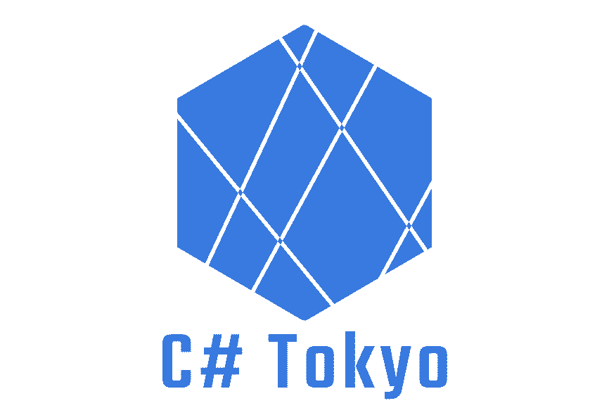

# C# Tokyo コミュニティ イベントテンプレート

## connpass イベントテンプレート

[イベント テンプレート](event_template.md)  
不要な項目は削ってイベントを立ててください。  

#### 画像

* 基本アイコン  
    

* イベントアイコン  
    
  
* 背景画像  
    

## 行動規範

[行動規範](code_of_conduct.md)  
リンクで参照してください。

## 会場貸し出し条件確認項目

[条件確認項目](venue_checkitems.md)  
会場をお貸しいただける場合は、こちらの確認項目を埋めて管理メンバーにご連絡ください。